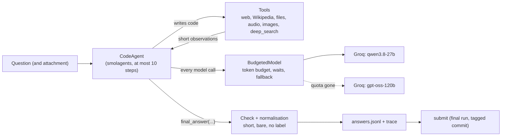

# hf-agents-course-gaia-agent

My final project for **Unit 4 of the [Hugging Face AI Agents Course](https://huggingface.co/learn/agents-course)**: an
agent built with [smolagents](https://github.com/huggingface/smolagents) (a `CodeAgent`) that answers the course's exam,
**20 level 1 questions from the validation set of the [GAIA benchmark](https://huggingface.co/gaia-benchmark)**. The
course gives a certificate of completion for a score of **30% or more (6 correct answers out of 20)**; the target here
is 7 or more, to keep a margin.

The agent writes Python to plan and call its tools (web search, Wikipedia, files, audio, images), and it runs on the
**free tier of Groq**, whose limits shape most of the design (see [Models and limits](#models-and-limits)).

## Contents

* [Architecture](#architecture)
* [Tools](#tools)
* [Models and limits](#models-and-limits)
* [Requirements and install](#requirements-and-install)
* [How to run it](#how-to-run-it)
* [Settings](#settings)
* [Integrity](#integrity)
* [AI assistance](#ai-assistance)
* [Safety model](#safety-model)
* [Development](#development)
* [Results](#results)
* [Credits](#credits)
* [License](#license)

## Architecture



* `agent.py` builds the `CodeAgent` (a compact system prompt, the tools, at most 10 steps) and answers one question
  from a clean memory. Every `final_answer` goes through a check (`_answer_check.py`) that refuses an empty answer, a
  "FINAL ANSWER" label, several lines, a refusal ("I cannot...") and a sentence; the model is then told to try again.
  `answer.py` removes the formatting noise an exact-match scorer would punish. The course scorer compares the answer
  with the reference after `strip().lower()`, letter by letter, so the answer has to be the bare value.
* `budget.py` wraps the models in a `BudgetedModel`: it keeps every request inside the per-minute token budget of each
  model, waits and retries on rate limits, and moves to the next model when a daily quota is gone, a model has been
  retired or a key is rejected. `provider_errors.py` tells these failures apart.
* `memory.py` shortens what the memory keeps about old steps (observations, and errors, which smolagents sends in full
  with every later request) and squeezes harder when the next prompt would go over `max_prompt_tokens`.
* `reply_format.py` repairs replies that lost their code tags, drops `<think>` reasoning, and holds the model to
  calling `final_answer` alone, after the evidence has been seen.
* `run.py` answers the questions and saves the answers and traces of a run; `submit.py` sends the answers of a final
  run to the scoring API.

## Tools

The agent gets these tools (`gaia_agent/tools`); each output is compact and says when it was cut:

| Tool | What it does |
| --- | --- |
| `web_search` | Web search (through `ddgs`), a few results at a time. |
| `read_webpage` | Reads a web page, PDF or text file as text, with guards against local addresses; a `query` returns only the relevant passages. |
| `wikipedia_search`, `wikipedia_page` | Wikipedia; a page can be read as it was on a given date, and tables are kept. |
| `read_file` | Reads an attachment: text, csv, xlsx, pdf, docx, pptx. |
| `youtube_transcript` | The transcript of a YouTube video. |
| `transcribe_audio` | Speech to text for an audio attachment (Groq Whisper). |
| `describe_image` | Answers a question about an image attachment (Groq vision model). Needs `GROQ_API_KEY`. |
| `deep_search` | One call to Groq's built-in browser search (`openai/gpt-oss-20b`), which does several searches and returns a short answer with its sources. Limited uses per question and per run. Needs `GROQ_API_KEY`. |
| `ask_about_video` | Optional: a question about a video, through Gemini. Needs `GEMINI_API_KEY`. |
| `run_python_file` | Optional and **off by default**: runs the `.py` attachment of the question. |

## Models and limits

Groq's free tier gives each model **8,000 tokens per minute and 200,000 tokens per day** (checked on 6 October 2026;
Groq changes these numbers). A request whose input alone is over about 8,000 tokens is refused with HTTP 413 and can
never pass, however long it waits; the `max_tokens` of the reply does not count towards that ceiling. That is why:

* the memory is cut: old observations and errors are shortened and the prompt is kept under `max_prompt_tokens`
  (5,000 tokens by default), so a request always fits;
* the agent waits: `BudgetedModel` books the real tokens of each call in a sliding one-minute window and sleeps until the
  next request fits, and it waits for the `retry-after` of a 429;
* the models are chosen by what they cost: **`qwen/qwen3.8-27b`** is the main model (it also reads images, and is used
  without `reasoning_effort`, which would switch its reasoning on); **`openai/gpt-oss-120b`** (with
  `reasoning_effort="low"`) takes over when the first one's daily quota is gone; **`openai/gpt-oss-20b`** is kept for
  `deep_search`, where the browser search lives.

When every model has used its daily quota a run can stop (the default) or wait for the quota to come back
(`--wait-for-quota`, see below). Nothing here pays for anything: no billing is set up.

## Requirements and install

* Python 3.12 and [uv](https://docs.astral.sh/uv/).
* A Groq API key (`GROQ_API_KEY`): the language models, audio transcription, image questions and `deep_search`.
* Optional: a Hugging Face token (`HF_TOKEN`, from an account that accepted the GAIA terms), used only to download an
  attachment that the scoring API does not serve, from the dataset repository: the one file a question names, nothing
  else.
* Optional: a Google AI Studio key (`GEMINI_API_KEY`), which adds `ask_about_video`. On the free tier Google may use what
  you send to improve its products, and people may read it: for a benchmark, use a key with billing enabled or leave it
  unset.

Keys are read from the environment (or, on Windows, from the user environment) and are never written to a file, a log,
a trace or an error message. Never put one in the repository.

```powershell
uv sync
```

The package is not installed: run the commands below from the root of the repository.

## How to run it

```powershell
# Answer the questions (all of them, or only some). Answers, traces and the token use go to <data>\runs\<time>.
uv run python -m gaia_agent.run
uv run python -m gaia_agent.run --limit 3
uv run python -m gaia_agent.run --task <task id> --verbose
uv run python -m gaia_agent.run --run-dir <time>          # resume: answered questions are skipped, failed ones retried
```

Two options for a long run on the free tier:

* `--wait-for-quota`: when every model is out of daily quota, wait (at most 15 minutes at a time, and never longer than
  the provider's `retry-after`) and ask the same question again, for up to `--max-wait-hours` (36 by default). A
  rejected key still stops the run.
* `--defer-missing-attachments`: a question whose attachment cannot be fetched is left unanswered instead of answered
  without the file; the summary says how many were deferred, and a later `--run-dir` run answers them once the file can
  be had.

### The final run and the submission

The answers that are submitted come from a **final run**, which ties them to the exact code that produced them:

```powershell
git status                       # the working tree must be clean
git tag v1.0.0                   # HEAD must be on a tag
uv run python -m gaia_agent.run --final --wait-for-quota
```

`--final` refuses to start unless the working tree is clean and `HEAD` is on a tag, and it writes `run.json` in the
run folder with the commit, the tag, the models, the step limit, the start time and the environment variables that
change the agent's behaviour (`GAIA_ALLOW_RUN_PYTHON`, `GAIA_DEEP_SEARCH_MAX`). A final run can only be resumed on the
same commit, and each resume is added to `run.json`.

Then push the commit and the tag, and submit. `submit` only accepts a final run, needs an answer for every question, is
a dry run unless you add `--yes`, and wants the `--agent-code` link to name the tag (or the commit) of the run:

```powershell
git push origin main v1.0.0
uv run python -m gaia_agent.submit --username <your Hugging Face user> --agent-code https://github.com/<owner>/<repo>/tree/v1.0.0
uv run python -m gaia_agent.submit --username <your Hugging Face user> --agent-code https://github.com/<owner>/<repo>/tree/v1.0.0 --yes
```

The console shows the score, the number of correct answers, the number attempted and the server's message; never the
answers. The attempt is saved as `submission.json` in the run folder (outside the repository).

## Settings

| Variable | Meaning |
| --- | --- |
| `GROQ_API_KEY`, `HF_TOKEN`, `GEMINI_API_KEY` | Keys (see above). |
| `GAIA_DATA_DIR` | The data folder (default `%LOCALAPPDATA%\hf-gaia-agent` or `~/.local/share/hf-gaia-agent`). Must be outside the repository and must not be a drive root, your home folder or a parent of the repository. |
| `GAIA_MODEL_ID` | The main model, default `groq/qwen/qwen3.8-27b`. |
| `GAIA_FALLBACK_MODELS` | Comma-separated models tried when the first runs out of quota, default `groq/openai/gpt-oss-120b`. `none` switches them off. |
| `GAIA_GEMINI_MODEL` | The Gemini model of `ask_about_video`. |
| `GAIA_DEEP_SEARCH_MAX` | How many times `deep_search` may be used in one run (default 5). |
| `GAIA_ALLOW_RUN_PYTHON` | `1` offers the `run_python_file` tool (off by default, see below). |

## Integrity

The point of the exam is an agent that finds its answers, so this repository is built so that it cannot be otherwise:

* **No handwritten answers and no per-question logic.** Nothing in the code or in the prompts is written for a
  particular question: no question text, no page name, date or number taken from one, no task id. The prompts and the
  tools are general.
* **No comparison with the GAIA reference answers.** The repository has no way to score a run locally: there is no
  evaluation script and nothing downloads the benchmark metadata, the file that holds the reference answers. The only
  thing fetched from the dataset is the attachment a question names, never `metadata*`, `*.parquet` or `*.jsonl` files
  (`tests/test_no_oracle.py` checks this), and `run` refuses to start if a file that looks like that metadata is in the
  data folder. The only verdict on the answers is the one the course's scoring API returns on submission.
* **Nothing of the dataset in the repository.** No question, no answer, no attachment, no task id. The benchmark
  material (question list, attachments, runs, traces) lives in the data folder **outside** the repository, which the
  agent refuses to place inside it; `.gitignore` is the second net. `tests/test_integrity.py` scans every tracked file
  and the whole git history for task ids and credentials. The GAIA dataset asks not to be reshared in a crawlable
  form, and this repository respects that.
* **The agent does not read the places that publish answers**: the GAIA dataset, Spaces and repositories of other
  students' answers, forum threads about the exercise. `read_webpage` refuses them and refuses a page that looks like
  a file of task ids and answers, and `deep_search` drops any result that used such a source
  (`gaia_agent/tools/_sources.py`).
* **The submitted answers come from a tagged commit.** `run --final` and `submit` tie the answers to the code a reader
  finds at the link they are given. These checks guard against mistakes, not against the author: whoever holds the run
  files could still edit them.

Failures were debugged by looking at errors, formats, token use and, where the trace showed it, whether the source the
agent cited supports its answer; never by checking answers against the real ones. The question list was visible to the
author and to the assistant while the agent was being built: the absence of per-question logic rests on that
discipline and on the tests in this repository, not on a proof.

## AI assistance

The code was written with **Claude Code (Anthropic)**, at the direction of **Rafael Graça**, who ran it and is
responsible for the submission. This is stated for transparency; the course itself has no rule about it.

## Safety model

The code a language model writes is not trusted, and neither is the text it reads (a web page can try to steer it).

* The code runs in the smolagents `LocalPythonExecutor`, which is **not a sandbox**. What keeps it harmless is what it
  is given: only modules that compute (`math`, `statistics`, `re`, `json`, `datetime`, `collections`, `itertools`,
  `fractions`, `decimal`, `unicodedata`, `csv`). pandas and numpy are deliberately absent: they read and write any
  file, fetch URLs and unpickle data. `tests/test_agent_sandbox.py` pins this down.
* The only doors to the outside are the tools, and each has its guard:
  * `read_webpage` refuses local and private addresses in three layers: the text of the URL (read the way `urllib3` will
    read it), what the host name resolves to, and the address the socket actually connected to, redirect hops included;
  * the file tools only open files in the attachments folder, never the rest of the data folder;
  * `run_python_file` starts a program with your privileges, which no isolation here can prevent (it could read the
    Windows user environment, where tokens may be stored). It is therefore **off** unless `GAIA_ALLOW_RUN_PYTHON=1`
    (read the attachment first) and runs only the `.py` attachment of the question being answered.
* Traces and answers go through a mask that hides the keys.

### Limitations

* The timeout of a code block is not preemptive (smolagents only reports it once the block returns): a call that never
  returns blocks the run. Stop it with Ctrl+C and resume with `--run-dir`.
* The web tools ignore proxy settings (through a proxy the real destination could not be checked).
* `deep_search` runs on Groq's search model with its own small daily quota; when it is gone the tool says so and the
  agent falls back to `web_search` and `read_webpage`.
* Written and tested on Windows; the path handling is written for other systems too.

## Development

```powershell
uv run pytest                                # no network: the tests are hermetic
uv run pytest --cov=gaia_agent               # coverage must stay at 80% or more
uvx ruff check .; uvx ruff format --check .
```

The tests never reach the network (a fixture blocks it) and use invented data only. The one exception is
`tests/test_integrity.py`, which also reads the local question list, when there is one, only to check that none of it
is in the repository.

## Results

<!-- RESULTS: fill in after the submission. Score and date only; never a per-question answer. -->

To be filled in after the submission:

| | |
| --- | --- |
| Tag submitted | _(tag)_ |
| Score | _(score)_ |
| Submitted on | _(date)_ |
| Main model | _(model)_ |

## Credits

* [smolagents](https://github.com/huggingface/smolagents), by Hugging Face, which provides the `CodeAgent`.
* The [Hugging Face AI Agents Course](https://huggingface.co/learn/agents-course) and its Unit 4 exam, and the
  [GAIA benchmark](https://huggingface.co/gaia-benchmark) (Mialon et al., "GAIA: a benchmark for General AI
  Assistants") the questions come from.
* The idea of using Groq's built-in browser search as a research tool (`deep_search`: `openai/gpt-oss-20b` with
  `browser_search`) comes from the public submission of another student, `OmarAbdullahQ/omar-gaia-agent`; the
  implementation here was written independently and no code was copied from it.

## License

MIT, see `LICENSE`.
